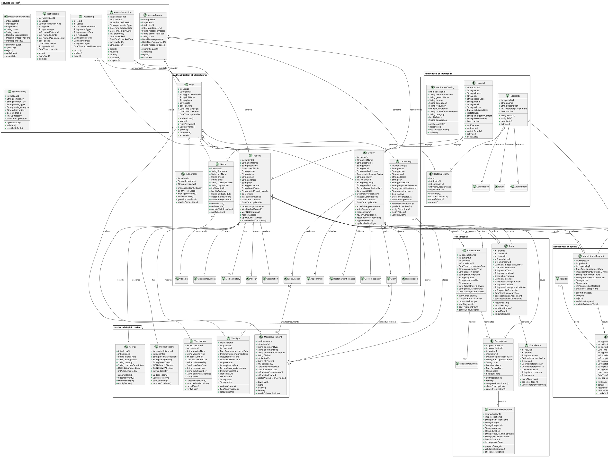

# Diagrammes de classes de l'application e-santé

```plantuml
@startuml "Diagrammes de classes e-santé"

' Package Authentification et Utilisateurs
package "Authentification et Utilisateurs" {
    class User {
        +int userId
        +String email
        +String passwordHash
        +String fullName
        +String phone
        +String role
        +bool isActive
        +DateTime lastLogin
        +DateTime createdAt
        +DateTime updatedAt
        +authenticate()
        +logout()
        +resetPassword()
        +updateProfile()
        +getRole()
        +deactivate()
        +activate()
    }

    class Patient {
        +int patientId
        +String firstName
        +String lastName
        +Date dateOfBirth
        +String gender
        +String phone
        +String email
        +String address
        +String city
        +String postalCode
        +String bloodGroup
        +String socialSecurityNumber
        +bool isChild
        +int? parentPatientId
        +DateTime createdAt
        +DateTime updatedAt
        +requestAppointment()
        +viewMedicalRecord()
        +viewNotifications()
        +requestAccess()
        +updateContactInfo()
        +shareMedicalDocument()
    }

    class Doctor {
        +int doctorId
        +String firstName
        +String lastName
        +String phone
        +String email
        +String medicalLicense
        +Date medicalLicenseExpiry
        +String speciality
        +int? hospitalId
        +String biography
        +String profilePhoto
        +Decimal consultationRate
        +bool isAvailable
        +Decimal averageRating
        +int totalConsultations
        +DateTime createdAt
        +DateTime updatedAt
        +scheduleAppointment()
        +writePrescription()
        +requestExam()
        +reviewConsultation()
        +respondAccessRequest()
        +approveAccess()
        +updateAvailability()
    }

    class Nurse {
        +int nurseId
        +String firstName
        +String lastName
        +String phone
        +String email
        +String nursingLicense
        +String department
        +int? hospitalId
        +bool isAvailable
        +String shiftSchedule
        +DateTime createdAt
        +DateTime updatedAt
        +recordVitals()
        +reviewVitals()
        +updateShiftSchedule()
        +notifyDoctor()
    }

    class Laboratory {
        +int laboratoryId
        +String name
        +String phone
        +String email
        +String address
        +String city
        +String postalCode
        +String responsiblePerson
        +String specialitiesCovered
        +String openingHours
        +bool isActive
        +DateTime createdAt
        +DateTime updatedAt
        +receiveExamRequest()
        +publishExamResult()
        +assignTechnician()
        +notifyPatient()
        +validateExam()
    }

    class AdminUser {
        +int adminId
        +String department
        +String accessLevel
        +manageSystemSettings()
        +auditAccessLogs()
        +manageAccounts()
        +reviewReports()
        +grantPermissions()
        +revokePermissions()
    }

    User <|-- Patient
    User <|-- Doctor
    User <|-- Nurse
    User <|-- Laboratory
    User <|-- AdminUser

    Patient "1" -- "0..1" MedicalHistory : has
    Patient "1" -- "*" Allergy : records
    Patient "1" -- "*" Vaccination : receives
    Patient "1" -- "*" VitalSign : measuredBy
    Patient "1" -- "*" MedicalDocument : owns
    Doctor "1" -- "*" DoctorSpeciality : has
    Doctor "1" -- "*" Consultation : performs
    Doctor "1" -- "*" Prescription : issues
    Doctor "1" -- "*" Exam : orders
    Doctor "1" -- "*" Appointment : schedules
    Doctor "1" -- "*" DoctorPatientRequest : initiates
}

package "Dossier médical du patient" {
    class MedicalHistory {
        +int medicalHistoryId
        +int patientId
        +String medicalConditions
        +String familyHistory
        +String bloodGroup
        +JSON chronicDiseases
        +JSON knownAllergies
        +int? updatedBy
        +updateHistory()
        +validateHistory()
        +addCondition()
        +removeCondition()
    }

    class Allergy {
        +int allergyId
        +int patientId
        +String allergyType
        +String allergyName
        +String severity
        +String reactionDescription
        +Date documentedDate
        +int? documentedBy
        +reportAllergy()
        +updateSeverity()
        +removeAllergy()
        +notifyDoctor()
    }

    class Vaccination {
        +int vaccinationId
        +int patientId
        +String vaccineName
        +String vaccineType
        +int doseNumber
        +Date vaccinationDate
        +int? administeredBy
        +Date? nextDoseDate
        +String manufacturer
        +String batchNumber
        +String administrationSite
        +String notes
        +scheduleNextDose()
        +recordAdministration()
        +cancelDose()
        +verifyDose()
    }

    class VitalSign {
        +int vitalSignId
        +int patientId
        +int? nurseId
        +DateTime measurementDate
        +Decimal temperatureCelsius
        +int systolicPressure
        +int diastolicPressure
        +int pulseBpm
        +int respiratoryRate
        +Decimal oxygenSaturation
        +Decimal weightKg
        +int heightCm
        +Decimal bmi
        +String status
        +String notes
        +evaluateStatus()
        +flagAbnormalities()
        +calculateBmi()
    }

    class MedicalDocument {
        +int documentId
        +int patientId
        +String documentType
        +String documentTitle
        +String documentDescription
        +String filePath
        +int fileSizeKb
        +String fileFormat
        +int? uploadedBy
        +DateTime uploadDate
        +Date documentDate
        +int? relatedConsultationId
        +int? relatedExamId
        +bool isAvailableForDownload
        +download()
        +share()
        +archive()
        +delete()
        +attachToConsultation()
    }

    Patient "1" -- "1" MedicalHistory : has
    Patient "1" -- "*" Allergy : declares
    Patient "1" -- "*" Vaccination : receives
    Patient "1" -- "*" VitalSign : stores
    Patient "1" -- "*" MedicalDocument : stores
    Nurse "0..1" -- "*" VitalSign : records
    User "0..1" -- "*" MedicalDocument : uploads
    Consultation "0..*" -- "0..*" MedicalDocument : relatedDocuments
    Exam "0..*" -- "0..*" MedicalDocument : relatedDocuments
}

package "Flux clinique" {
    class Consultation {
        +int consultationId
        +int patientId
        +int doctorId
        +int? specialityId
        +DateTime consultationDate
        +String consultationType
        +String reasonForVisit
        +String chiefComplaint
        +String diagnosis
        +String treatmentPlan
        +String notes
        +Date futureDateFollowUp
        +String consultationStatus
        +bool prescriptionIncluded
        +startConsultation()
        +completeConsultation()
        +requestFollowUp()
        +addDiagnosis()
        +addTreatmentPlan()
        +cancelConsultation()
    }

    class Prescription {
        +int prescriptionId
        +int consultationId
        +int patientId
        +int doctorId
        +DateTime prescriptionDate
        +String prescriptionNumber
        +String status
        +Date issueDate
        +Date? expiryDate
        +String notes
        +bool canShare
        +addMedication()
        +renew()
        +completePrescription()
        +sharePrescription()
        +cancelPrescription()
    }

    class PrescriptionMedication {
        +int medicationId
        +int prescriptionId
        +String medicationName
        +String dosage
        +String dosageUnit
        +String frequency
        +String duration
        +String routeOfAdministration
        +String specialInstructions
        +bool isEssential
        +int sequenceOrder
        +prepareDosage()
        +validateMedication()
        +checkInteractions()
    }

    class Exam {
        +int examId
        +int patientId
        +int doctorId
        +int? specialityId
        +int? laboratoryId
        +String examRequestNumber
        +DateTime examDate
        +String examType
        +String urgencyLevel
        +String observations
        +String examStatus
        +String resultInterpretation
        +String resultValues
        +String resultInterpretationNotes
        +int? signedByTechnician
        +DateTime? signatureDate
        +bool notificationPatientSent
        +bool notificationDoctorSent
        +requestExam()
        +recordResult()
        +sendNotification()
        +cancelExam()
        +validateResult()
    }

    class ExamResult {
        +int resultId
        +int examId
        +String testName
        +Decimal measuredValue
        +String unit
        +Decimal referenceMin
        +Decimal referenceMax
        +bool isAbnormal
        +String interpretation
        +String notes
        +markAbnormal()
        +generateReport()
        +updateReferenceRange()
    }

    Consultation "1" -- "0..*" Prescription : generates
    Prescription "1" -- "*" PrescriptionMedication : contains
    Patient "1" -- "*" Consultation : attends
    Doctor "1" -- "*" Consultation : performs
    Doctor "1" -- "*" Prescription : issues
    Consultation "1" -- "0..*" MedicalDocument : related
    Patient "1" -- "*" Exam : undergoes
    Doctor "1" -- "*" Exam : orders
    Laboratory "0..1" -- "*" Exam : executes
    Exam "1" -- "*" ExamResult : contains
}

package "Rendez-vous et agenda" {
    class AppointmentRequest {
        +int requestId
        +int patientId
        +int? specialityId
        +DateTime appointmentDate
        +int appointmentDurationMinutes
        +String appointmentType
        +String reasonForAppointment
        +String notes
        +String status
        +int? acceptedByDoctorId
        +DateTime? acceptedAt
        +submitRequest()
        +accept()
        +reject()
        +withdrawRequest()
        +updatePreferredTime()
    }

    class Appointment {
        +int appointmentId
        +int patientId
        +int doctorId
        +DateTime appointmentDate
        +int appointmentDurationMinutes
        +int? specialityId
        +int? hospitalId
        +String appointmentType
        +String status
        +String reasonForAppointment
        +String notes
        +bool reminderSent
        +DateTime? reminderSentDate
        +int? appointmentRequestId
        +confirm()
        +cancel()
        +reschedule()
        +sendReminder()
        +checkConflicts()
    }

    class UnavailableSlot {
        +int unavailableSlotId
        +int doctorId
        +DateTime startDate
        +DateTime endDate
        +String reason
        +int? createdBy
        +createBlock()
        +releaseBlock()
        +updatePeriod()
    }

    Patient "1" -- "*" AppointmentRequest : makes
    Patient "1" -- "*" Appointment : attends
    Doctor "1" -- "*" AppointmentRequest : mayAccept
    Doctor "1" -- "*" Appointment : conducts
    AppointmentRequest "0..1" -- "1" Appointment : resultsIn
    Doctor "1" -- "*" UnavailableSlot : blocks
    Hospital "0..*" -- "*" Appointment : hosts
}

package "Sécurité et accès" {
    class AccessPermission {
        +int permissionId
        +int patientId
        +int authorizedUserId
        +String permissionType
        +DateTime grantedDate
        +DateTime? expiryDate
        +int? grantedBy
        +bool isRevoked
        +DateTime? revokedDate
        +int? revokedBy
        +String reason
        +grant()
        +revoke()
        +renew()
        +isExpired()
        +suspend()
    }

    class AccessRequest {
        +int requestId
        +int patientId
        +int doctorId
        +int requesterUserId
        +String reasonForAccess
        +String permissionType
        +String status
        +DateTime requestedAt
        +DateTime? respondedAt
        +String responseReason
        +submitRequest()
        +approve()
        +reject()
        +escalate()
    }

    class DoctorPatientRequest {
        +int requestId
        +int doctorId
        +int patientId
        +String status
        +String reason
        +DateTime requestedAt
        +DateTime? respondedAt
        +int? respondedBy
        +submitRequest()
        +approve()
        +reject()
        +withdraw()
        +escalate()
    }

    class AccessLog {
        +int logId
        +int userId
        +int? accessedPatientId
        +String actionType
        +String resourceType
        +int? resourceId
        +String accessStatus
        +String ipAddress
        +String userAgent
        +DateTime accessTimestamp
        +record()
        +analyse()
        +export()
    }

    class Notification {
        +int notificationId
        +int userId
        +String notificationType
        +String title
        +String message
        +int? relatedPatientId
        +int? relatedExamId
        +int? relatedAppointmentId
        +bool isRead
        +DateTime? readAt
        +String actionUrl
        +DateTime createdAt
        +send()
        +markRead()
        +dismiss()
    }

    class SystemSetting {
        +int settingId
        +String settingKey
        +String settingValue
        +String settingType
        +String settingCategory
        +String description
        +bool isEditable
        +int? updatedBy
        +DateTime updatedAt
        +updateValue()
        +validate()
        +resetToDefault()
    }

    AccessPermission "*" -- "1" Patient : controls
    AccessPermission "*" -- "1" User : grantsTo
    AccessRequest "*" -- "1" Patient : concerns
    AccessRequest "*" -- "1" Doctor : requestedBy
    AccessRequest "*" -- "1" User : requester
    AccessLog "*" -- "1" User : performedBy
    AccessLog "0..1" -- "1" Patient : targets
}

package "Référentiels et catalogue" {
    class Hospital {
        +int hospitalId
        +String name
        +String address
        +String city
        +String postalCode
        +String phone
        +String email
        +String website
        +Date establishedDate
        +int totalBeds
        +String emergencyContact
        +String directorName
        +bool isActive
        +addDoctor()
        +addNurse()
        +updateDetails()
        +activate()
        +deactivate()
    }

    class Speciality {
        +int specialityId
        +String name
        +String description
        +int? laboratoryAssignment
        +bool isActive
        +assignDoctor()
        +assignLab()
        +deactivate()
        +activate()
    }

    class DoctorSpeciality {
        +int id
        +int doctorId
        +int specialityId
        +int yearsOfExperience
        +bool isPrimary
        +setPrimary()
        +updateExperience()
        +unsetPrimary()
        +remove()
    }

    class MedicationCatalog {
        +int medicationId
        +String medicationName
        +String genericName
        +String dosage
        +String dosageUnit
        +String frequency
        +int defaultDuration
        +String routeOfAdministration
        +String category
        +bool isActive
        +String description
        +getDosageInfo()
        +deactivate()
        +updateDescription()
        +archive()
    }

    Doctor "1" -- "*" DoctorSpeciality : practices
    Speciality "1" -- "*" DoctorSpeciality : describes
    Hospital "1" -- "*" Doctor : employs
    Hospital "1" -- "*" Nurse : employs
    Speciality "1" -- "*" Consultation : relatesTo
    Speciality "1" -- "*" Exam : relatesTo
    Speciality "1" -- "*" Appointment : relatesTo
    Speciality "1" -- "*" AppointmentRequest : relatesTo
}

@enduml
```
